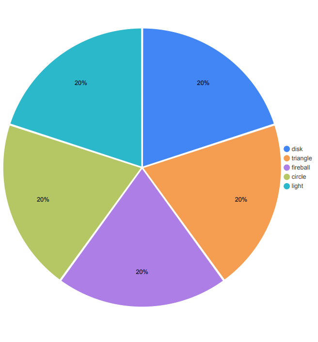
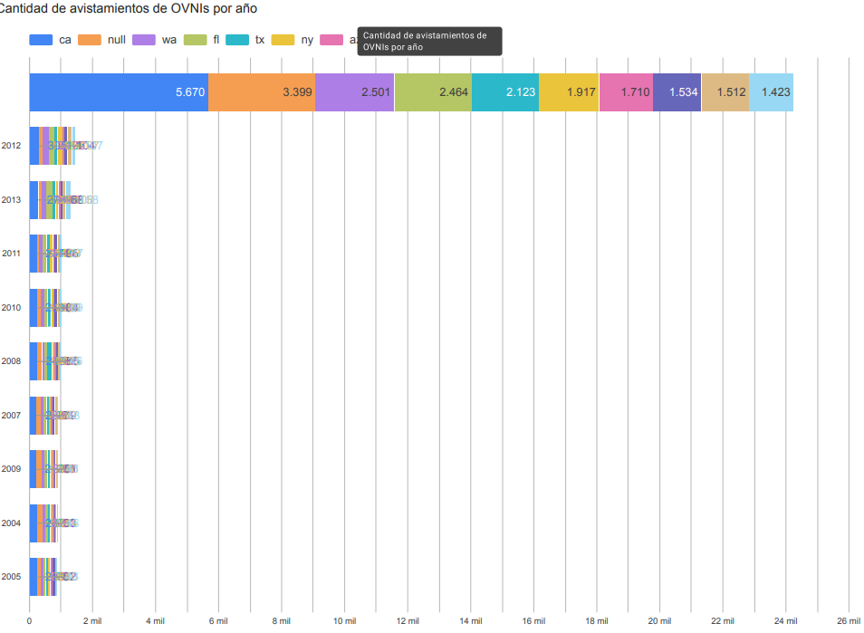
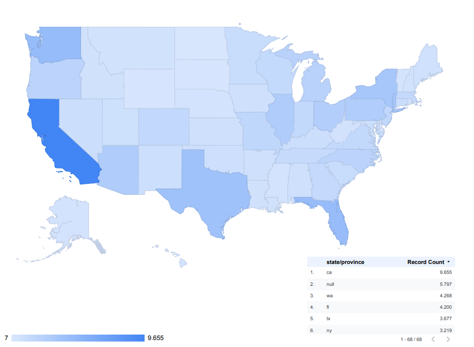

# 🛸 Avistamientos OVNI

¡Explora los fenómenos más misteriosos del cielo!

Este proyecto recopila y visualiza datos históricos sobre avistamientos de OVNIs en Estados Unidos, con un enfoque interactivo y visual.

---

## 👽 ¡Bienvenido al sitio!

Aquí exploraremos los avistamientos de OVNIs ocurridos a lo largo del tiempo, especialmente en distintas regiones de los Estados Unidos.

Utilizando herramientas como **BigQuery**, **DataPrep**, **R Studio** y **Google Cloud (GCloud)**, realizamos una visualización de los resultados obtenidos en una base de datos que abarca registros desde **1945 hasta la actualidad**.

> Te invitamos a quedarte y sumergirte en el misterio. ✨

---

## 📊 Gráfico 1: Avistamientos de OVNIs según forma

Este gráfico muestra la distribución de los avistamientos de OVNIs según su forma. Las figuras más reportadas incluyen luces, esferas y discos, destacándose como las más comunes entre los registros.

---

## 📈 Gráfico 2: Avistamientos de OVNIs por año

Este gráfico presenta la evolución anual de los avistamientos de OVNIs. Se observa un notable aumento en los reportes durante los años 2011, 2012 y 2013, concentrando la mayor cantidad de registros en ese período.

---

## 🗺️ Gráfico 3: Avistamientos de OVNIs por estado

Este gráfico refleja la distribución de avistamientos de OVNIs por estado. California, Washington y Florida destacan como las regiones con la mayor cantidad de reportes registrados.
---

## Proyecto realizado por

Nicolás Andrade y Eduardo Orellana